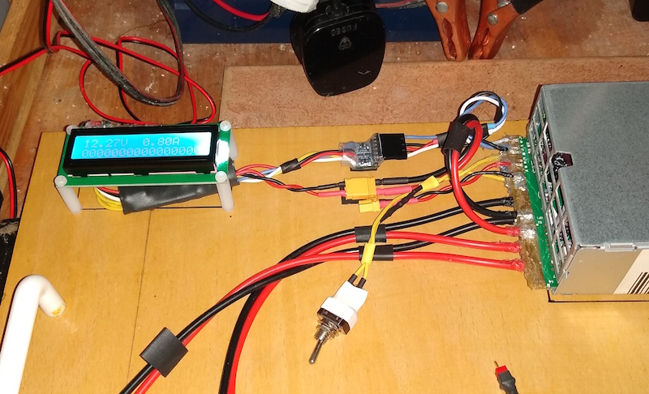

# dps750tb_psu_i2c

Arduino program for extracting data from a DPS-750TB power supply and driving a display and/or web page. 

Should be easy to modify to work with any other PMBus 1.0 compliant power supply.

Details of how to get the power supply running can be found on Peter Lorenzen's blog and the RCG forum.

The I2C pullups in the DPS-750TB are very weak. I had to add a couple of 10k's to get an ESP32 to speak to it. 
If you use a 5V Arduino, e.g. a Nano, you will need a level converter between the Arduino and the DPS-750TB 
(use the outer pins on the converter linked to below).

* References
  * http://peter.lorenzen.us/linux/server-power-supply-dps-750tb
  * https://www.rcgroups.com/batteries-and-chargers-129/

* Libraries
  * https://github.com/olikraus/u8g2
  * https://github.com/fmalpartida/New-LiquidCrystal

* Hardware
  * https://www.banggood.com/Geekcreit-ATmega328P-Nano-V3-Controller-Board-Improved-Version-Module-Development-Board-p-940937.html
  * https://www.banggood.com/Geekcreit-IIC-or-I2C-1602-Blue-Backlight-LCD-Display-Screen-Module-Geekcreit-for-Arduino-products-that-work-with-official-Arduino-boards-p-950726.html
  * https://www.banggood.com/10Pcs-Two-Channel-IIC-I2C-Logic-Level-Converter-Bi-Directional-Module-p-979922.html
  * https://uk.banggood.com/Geekcreit-ESP32-WiFi+bluetooth-Development-Board-Ultra-Low-Power-Consumption-Dual-Cores-Pins-Unsoldered-p-1214159.html
  * https://www.banggood.com/1_3-Inch-4Pin-White-OLED-LCD-Display-12864-IIC-I2C-Interface-Module-p-1067874.html

